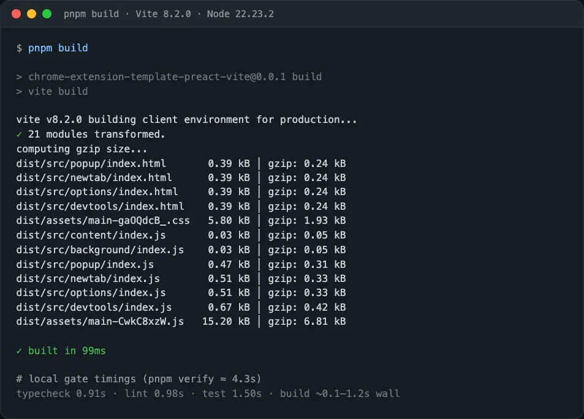

  
  <h1>
    Chrome extension template with  Preact, Tailwind CSS, Vitest, Vite and
    TypeScript
  </h1>

## Table of Contents

- [Intro](#intro)
- [Features](#features)
- [Installation](#installation)
  - [Procedures](#procedures)
- [Scripts](#scripts)
- [Screenshots](#screenshots)
  - [NewTab](#newtab)
  - [Popup](#popup)
  - [DevTools](#devtools)
- [Recommendations](#recommends)

## Intro 

This template was made with a goal to reduce as much as possible the extension's
bundle size, while also having a blazing fast build speed and overall great
developer experience with Vite.

Fresh cold `pnpm build` on this template (Vite 8 / Node 22):

| Metric | Value |
| ------ | ----- |
| Vite build time | ~67–99 ms |
| Shared JS chunk | 15.20 kB (6.81 kB gzip) |
| Shared CSS | 5.80 kB (1.93 kB gzip) |
| Page entrypoints | ~0.47–0.67 kB each |
| Background / content | ~0.03 kB each |
| Full `pnpm verify` | ~4.3 s locally |

## Features 

- [Preact](https://preactjs.com/)
- [TypeScript](https://www.typescriptlang.org/)
- [Vite](https://vitejs.dev/)
- [Tailwind CSS](https://tailwindcss.com/)
- [ESLint](https://eslint.org/) (flat config)
- [Prettier](https://prettier.io/)
- [Vitest](https://vitest.dev/)
- [Chrome Extension Manifest Version 3](https://developer.chrome.com/docs/extensions/mv3/intro/)

## Installation 

### Procedures 

1. Run `npx degit fell-lucas/chrome-extension-template-preact-vite my-project` or
   click `Use this template` on GitHub.
2. Change `name` and `description` in `package.json` => **Auto synchronize with
   manifest**
3. Ensure Node.js `>= 22.22.2` (see `.nvmrc`) and enable Corepack or install
   pnpm 10+.
4. Run `pnpm install`
5. Run `pnpm dev` to watch files and rebuild on changes
6. Load Extension on Chrome
   1. Open - Chrome browser
   2. Access - `chrome://extensions`
   3. Check - Developer mode
   4. Find - Load unpacked extension
   5. Select - `dist` folder in this project (after `dev` or `build`)
7. For a one-off production build, run `pnpm build`.

## Scripts 

| Script           | Description                                    |
| ---------------- | ---------------------------------------------- |
| `pnpm dev`       | Watch mode via `vite build --watch`            |
| `pnpm build`     | Production build to `dist/`                    |
| `pnpm typecheck` | TypeScript (`tsc --noEmit`)                    |
| `pnpm lint`      | ESLint                                         |
| `pnpm format`    | Prettier write                                 |
| `pnpm test`      | Vitest                                         |
| `pnpm verify`    | typecheck → lint → format check → test → build |

## Screenshots 

### New Tab 

### Popup 

### Dev Tools 

## Recommendations 

VS Code extensions (also listed in `.vscode/extensions.json`):

- [vscode-eslint](https://marketplace.visualstudio.com/items?itemName=dbaeumer.vscode-eslint)
- [prettier-vscode](https://marketplace.visualstudio.com/items?itemName=esbenp.prettier-vscode)
- [vscode-tailwindcss](https://marketplace.visualstudio.com/items?itemName=bradlc.vscode-tailwindcss)
- [Vitest](https://marketplace.visualstudio.com/items?itemName=vitest.explorer)

## Inspired by

[Jonghakseo](https://nookpi.tistory.com/) @
[Repo](https://github.com/Jonghakseo/chrome-extension-boilerplate-react-vite)
and [Vitesse Webext](https://github.com/antfu/vitesse-webext)

## License

Distributed under the
[MIT License](https://github.com/fell-lucas/chrome-extension-template-preact-vite/blob/main/LICENSE).
